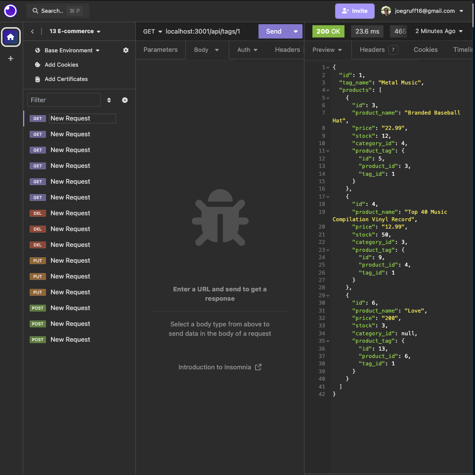

# e-comm-retailer

## Description

This app allows you to customize the database of your personal e-commerce store. You can add, update, delete any category, product, or tag. You can also customize the data however you would like by updating the seeds database if you wish. With the GET routes it is possible for users to search and locate all of the categories, products, and product tags.

## Finished Product

## Usage

-  
-  
- 

## License

## Video Link

<https://drive.google.com/file/d/1YF6kaQ1wJBCs6DGTA4FNfM6AkumU9rz4/view?usp=sharing>

## GitHub Repo

<https://github.com/joegruff16/e-comm-retailer>

## Credits

- Used this github to add usage markdown badges
  - **<https://github.com/Ileriayo/markdown-badges>**
- Added license badge
  - **<https://gist.github.com/lukas-h/2a5d00690736b4c3a7ba>**
